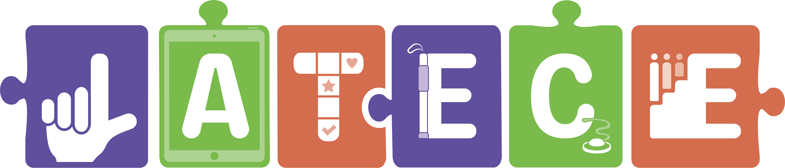
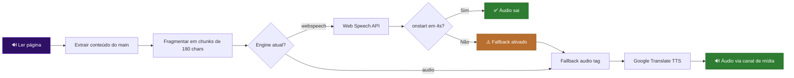
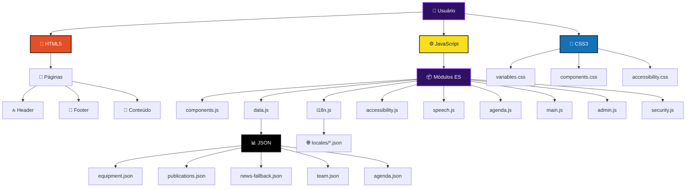
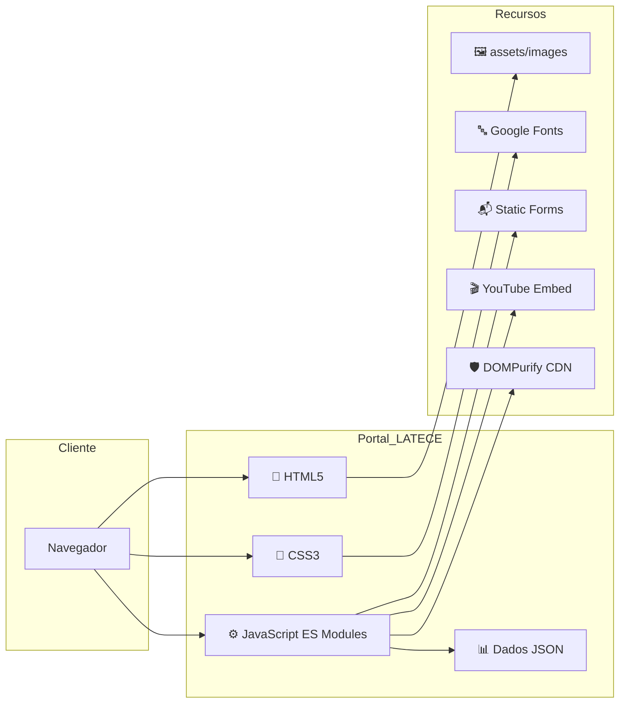
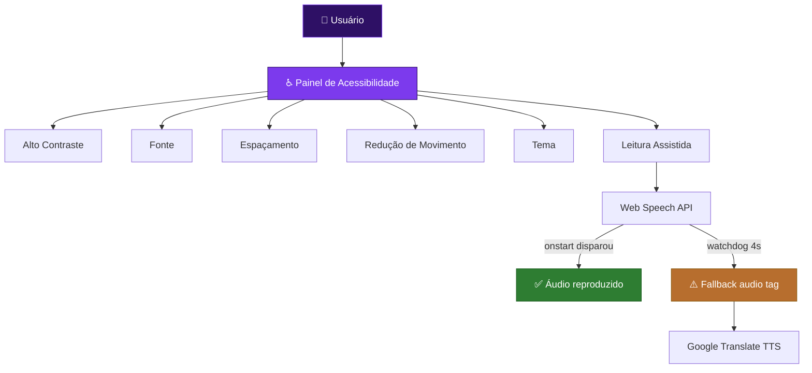

<!--
  README.md — Portal LATECE
  Versão: 3.1 (Estado Outubro/2026)
  Repositório: LATECE-UFRN/lateceufrn
  URL: https://latece-ufrn.github.io/lateceufrn/
  Última atualização: Outubro de 2026
-->

<p align="center">
  
</p>

<h1 align="center">Portal LATECE</h1>

<p align="center">
  <strong>Laboratório de Tecnologia Assistiva</strong><br>
  <em>Universidade Federal do Rio Grande do Norte — UFRN</em>
</p>

<p align="center">
  <a href="https://github.com/LATECE-UFRN/lateceufrn"></a>
  <a href="https://latece-ufrn.github.io/lateceufrn/"></a>
</p>

<p align="center">
  
  
  
  
  
  
  
  
</p>

<p align="center">
  <em>Promovendo inclusão e acessibilidade através da pesquisa, inovação e formação humana.</em>
</p>

<hr>

<div align="center">

## 📑 Sumário

</div>

<table>
<tr>
<td valign="top" width="50%">

**📖 Visão Geral**
- [Sobre o Portal](#-sobre-o-portal)
- [Objetivos do Projeto](#-objetivos-do-projeto)
- [Funcionalidades](#-funcionalidades)
- [Destaques Recentes](#-destaques-recentes)

**♿ Acessibilidade**
- [Acessibilidade Geral](#-acessibilidade-geral)
- [Leitura Assistida (TTS)](#-leitura-assistida-tts)
- [Agenda Acessível](#-agenda-acessível)
- [Sistema de Temas](#-sistema-de-temas)

**🎨 Design**
- [Identidade Visual](#-identidade-visual)
- [Paleta de Cores](#-paleta-de-cores)
- [Tipografia](#-tipografia)
- [Componentes Visuais](#-componentes-visuais)

</td>
<td valign="top" width="50%">

**🏗️ Arquitetura**
- [Arquitetura Técnica](#️-arquitetura-técnica)
- [Estrutura de Diretórios](#-estrutura-de-diretórios)
- [Módulos JavaScript](#-módulos-javascript)
- [Sistema de Componentes](#-sistema-de-componentes)
- [Sistema de Dados](#-sistema-de-dados)

**🌐 Produção**
- [Internacionalização](#-internacionalização)
- [GitHub Pages](#-github-pages)
- [SEO](#-seo)
- [Segurança](#-segurança)
- [Performance](#-performance)

**🛠️ Desenvolvimento**
- [Ferramental de Qualidade](#️-ferramental-de-qualidade)
- [Instalação Local](#-instalação-local)
- [Manutenção](#-manutenção)
- [Guia de Extensão](#-guia-de-extensão)
- [Roadmap](#-roadmap)

</td>
</tr>
</table>

<hr>

## 🌐 Sobre o Portal

O **Portal LATECE** é o website institucional do Laboratório de Tecnologia Assistiva do Centro de Educação da Universidade Federal do Rio Grande do Norte (UFRN). Sua missão é divulgar atividades, projetos, equipe e recursos do laboratório, promovendo **inclusão** e **acessibilidade** por meio da Tecnologia Assistiva.

É um **site estático**, construído com tecnologias web padrão (HTML5, CSS3, JavaScript Vanilla com ES Modules e JSON) e publicado no **GitHub Pages**. Oferece apresentação institucional, catálogos dinâmicos, ferramentas de interação com a comunidade acadêmica e um painel administrativo preparado para integração com backend institucional.

<br>

<table>
<thead>
<tr>
<th align="left">🔖 Atributo</th>
<th align="left">📋 Valor</th>
</tr>
</thead>
<tbody>
<tr><td><strong>Nome</strong></td><td>LATECE — Laboratório de Tecnologia Assistiva</td></tr>
<tr><td><strong>Sigla</strong></td><td>LATECE</td></tr>
<tr><td><strong>Instituição</strong></td><td>Universidade Federal do Rio Grande do Norte (UFRN) — Centro de Educação</td></tr>
<tr><td><strong>Vinculação</strong></td><td>LIFE — Laboratório Interdisciplinar de Formação de Educadores</td></tr>
<tr><td><strong>Natureza</strong></td><td>Website institucional estático</td></tr>
<tr><td><strong>Repositório</strong></td><td><a href="https://github.com/LATECE-UFRN/lateceufrn">LATECE-UFRN/lateceufrn</a></td></tr>
<tr><td><strong>URL de produção</strong></td><td><a href="https://latece-ufrn.github.io/lateceufrn/">https://latece-ufrn.github.io/lateceufrn/</a></td></tr>
<tr><td><strong>Tecnologias</strong></td><td>HTML5 · CSS3 · JavaScript (ES Modules) · JSON</td></tr>
<tr><td><strong>Hospedagem</strong></td><td>GitHub Pages (subdiretório <code>/lateceufrn/</code>)</td></tr>
<tr><td><strong>Versão atual</strong></td><td>3.1 (estado outubro/2026)</td></tr>
<tr><td><strong>Idiomas</strong></td><td>Português (pt) · Inglês (en) · Espanhol (es)</td></tr>
<tr><td><strong>Pipeline</strong></td><td>GitLab CI — validate · lint · security · accessibility</td></tr>
</tbody>
</table>

---

## 🎯 Objetivos do Projeto

<div align="center">

**Objetivo geral.** Disponibilizar um portal institucional que divulgue as atividades, projetos, recursos e a equipe do LATECE, promovendo acessibilidade, inclusão e democratização do conhecimento em Tecnologia Assistiva.

</div>

<br>

<table>
<thead>
<tr>
<th align="left">🎯 Objetivo</th>
<th align="left">📝 Descrição</th>
</tr>
</thead>
<tbody>
<tr><td><strong>Divulgação institucional</strong></td><td>Apresentar missão, visão e histórico do laboratório.</td></tr>
<tr><td><strong>Apresentação da equipe</strong></td><td>Exibir coordenação, técnicos, bolsistas, parceiros e desenvolvedores com links para Lattes.</td></tr>
<tr><td><strong>Catálogo de equipamentos</strong></td><td>Disponibilizar acervo de recursos de Tecnologia Assistiva com imagens, descrições e downloads.</td></tr>
<tr><td><strong>Repositório de publicações</strong></td><td>Listar artigos, teses, dissertações, capítulos e demais produções.</td></tr>
<tr><td><strong>Divulgação de notícias</strong></td><td>Publicar notícias, eventos e avisos.</td></tr>
<tr><td><strong>Canal de sugestões</strong></td><td>Oferecer formulário para ideias, críticas e contribuições da comunidade.</td></tr>
<tr><td><strong>Acessibilidade e inclusão</strong></td><td>Garantir acesso a todos, independentemente de habilidades ou condições.</td></tr>
<tr><td><strong>Recursos assistivos</strong></td><td>Integrar ajustes de contraste, fonte, espaçamento, temas e <strong>leitura assistida por voz</strong>.</td></tr>
<tr><td><strong>Agenda institucional</strong></td><td>Exibir calendário mensal com as atividades do laboratório.</td></tr>
<tr><td><strong>Gestão de conteúdo</strong></td><td>Painel administrativo preparado para backend institucional.</td></tr>
</tbody>
</table>

---

## ✅ Funcionalidades

### 🌐 Portal Público

<table>
<thead>
<tr>
<th align="left">Funcionalidade</th>
<th align="center">Estado</th>
<th align="left">Observações</th>
</tr>
</thead>
<tbody>
<tr>
<td><strong>Página Inicial</strong></td>
<td align="center">✅</td>
<td>Hero carrossel com 4 slides, missão, agenda mensal, carrossel de notícias e acesso rápido.</td>
</tr>
<tr>
<td><strong>Sobre o LATECE</strong></td>
<td align="center">✅</td>
<td>Missão, visão, objetivos estratégicos, justificativa e diferencial.</td>
</tr>
<tr>
<td><strong>Equipe</strong></td>
<td align="center">✅</td>
<td>Cards (coordenação, técnicos, bolsistas) + listas (parceiros, colaboradores, desenvolvedores).</td>
</tr>
<tr>
<td><strong>Equipamentos</strong></td>
<td align="center">✅</td>
<td>Catálogo com filtros, paginação e modais com galeria de imagens.</td>
</tr>
<tr>
<td><strong>Publicações</strong></td>
<td align="center">✅</td>
<td>Lista com filtros (tipo, ano, busca), paginação e modais detalhados.</td>
</tr>
<tr>
<td><strong>Notícias</strong></td>
<td align="center">✅</td>
<td>Listagem com filtros e paginação; detalhe com vídeo, tags e links.</td>
</tr>
<tr>
<td><strong>Sugestões</strong></td>
<td align="center">✅</td>
<td>Formulário com validação e envio via Static Forms.</td>
</tr>
<tr>
<td><strong>Termos de Uso</strong></td>
<td align="center">✅</td>
<td>Documento institucional (conteúdo estático em português).</td>
</tr>
<tr>
<td><strong>Política de Privacidade</strong></td>
<td align="center">✅</td>
<td>LGPD, dados coletados, retenção, direitos do titular.</td>
</tr>
<tr>
<td><strong>Página 404</strong></td>
<td align="center">✅</td>
<td>Personalizada com redirecionamento inteligente via <code>BASE_PATH</code>.</td>
</tr>
<tr>
<td><strong>Leitura Assistida</strong></td>
<td align="center">✅</td>
<td>Text-to-Speech com fallback de áudio e chunking automático.</td>
</tr>
<tr>
<td><strong>Agenda</strong></td>
<td align="center">✅</td>
<td>Calendário mensal com resumo acessível dos dias com eventos.</td>
</tr>
<tr>
<td><strong>Acessibilidade</strong></td>
<td align="center">✅</td>
<td>Painel completo: temas, contraste, fonte, espaçamento, motion.</td>
</tr>
<tr>
<td><strong>Internacionalização</strong></td>
<td align="center">✅</td>
<td>pt · en · es com seletor desktop e mobile.</td>
</tr>
</tbody>
</table>

### 🔐 Painel Administrativo

<table>
<thead>
<tr>
<th align="left">Funcionalidade</th>
<th align="center">Estado</th>
<th align="left">Observações</th>
</tr>
</thead>
<tbody>
<tr>
<td><strong>Login</strong></td>
<td align="center">🟡</td>
<td>Requer backend institucional (<code>/api/auth/login</code>). Sem fallback inseguro.</td>
</tr>
<tr>
<td><strong>Dashboard</strong></td>
<td align="center">🟡</td>
<td>Modo leitura. Estatísticas carregadas da API quando disponível.</td>
</tr>
<tr>
<td><strong>Gerenciar Notícias</strong></td>
<td align="center">🟡</td>
<td>Listagem e filtros funcionais; operações CRUD dependem de backend.</td>
</tr>
<tr>
<td><strong>Criar/Editar Notícia</strong></td>
<td align="center">🟡</td>
<td>Formulário com upload preparado para API.</td>
</tr>
<tr>
<td><strong>Criar Usuário</strong></td>
<td align="center">🟡</td>
<td>Requer chave mestre validada pelo backend.</td>
</tr>
</tbody>
</table>

> **⚠️ Nota importante.** O painel administrativo **não opera com dados mock em produção**. Quando a API não está disponível, exibe um aviso claro de indisponibilidade e redireciona o usuário de volta ao site.

---

## 🚀 Destaques Recentes

<table>
<thead>
<tr>
<th align="center">📅 Data</th>
<th align="left">🔧 Mudança</th>
</tr>
</thead>
<tbody>
<tr>
<td align="center"><strong>Out/2026</strong></td>
<td>Correção do autoplay do carrossel do hero + transição suave com Ken Burns.</td>
</tr>
<tr>
<td align="center"><strong>Out/2026</strong></td>
<td>Substituição de emojis por SVGs de biblioteca (Simple Icons + Lucide) em <code>news-detail</code>.</td>
</tr>
<tr>
<td align="center"><strong>Out/2026</strong></td>
<td>Adição de 4 notícias: Módulo 5 (2 encontros de TA e CAA), Curso de Audiodescrição, Oficina Livro para Todos.</td>
</tr>
<tr>
<td align="center"><strong>Out/2026</strong></td>
<td>Reescrita do <code>speech.js</code> com fallback de áudio — resolve falha silenciosa do SAPI5 no Windows.</td>
</tr>
<tr>
<td align="center"><strong>Out/2026</strong></td>
<td>Resumo acessível da agenda: leitura por voz somente dos dias com atividades no mês corrente.</td>
</tr>
<tr>
<td align="center"><strong>Set/2026</strong></td>
<td>Extração de scripts inline para módulos: <code>404-init.js</code>, <code>login-init.js</code>, <code>sugestoes-init.js</code>.</td>
</tr>
<tr>
<td align="center"><strong>Set/2026</strong></td>
<td>Introdução de <code>dev-log.js</code> (log condicional por ambiente) e <code>security.js</code>.</td>
</tr>
</tbody>
</table>

---

## ♿ Acessibilidade Geral

<div align="center">

O portal foi projetado com **acessibilidade como pilar central**. A tabela abaixo reflete o estado real dos recursos.

</div>

<br>

<table>
<thead>
<tr>
<th align="left">♿ Recurso</th>
<th align="left">🛠️ Implementação</th>
<th align="center">📊 Status</th>
</tr>
</thead>
<tbody>
<tr><td><strong>Skip link</strong></td><td><code>.skip-link</code> em todas as páginas</td><td align="center">✅ Funcional</td></tr>
<tr><td><strong>Foco visível</strong></td><td><code>:focus-visible</code> global</td><td align="center">✅ Funcional</td></tr>
<tr><td><strong>ARIA</strong></td><td>Atributos em componentes dinâmicos</td><td align="center">🟡 Parcial</td></tr>
<tr><td><strong>Painel de acessibilidade</strong></td><td><code>accessibility.js</code> + <code>accessibility.css</code></td><td align="center">✅ Funcional</td></tr>
<tr><td><strong>Alto contraste</strong></td><td><code>.high-contrast</code> (classe no <code>&lt;html&gt;</code>)</td><td align="center">✅ Funcional</td></tr>
<tr><td><strong>Tema escuro</strong></td><td><code>[data-theme="dark"]</code></td><td align="center">✅ Funcional</td></tr>
<tr><td><strong>Tema baixa visão</strong></td><td><code>[data-theme="low-vision"]</code></td><td align="center">🟡 Parcial</td></tr>
<tr><td><strong>Redução de movimento</strong></td><td><code>prefers-reduced-motion</code> + toggle</td><td align="center">✅ Respeitado</td></tr>
<tr><td><strong>Ajuste de fonte</strong></td><td>14px – 24px, persistido</td><td align="center">✅ Funcional</td></tr>
<tr><td><strong>Espaçamento</strong></td><td>Sliders de linha e letra</td><td align="center">✅ Funcional</td></tr>
<tr><td><strong>Leitura assistida (TTS)</strong></td><td><code>speech.js</code> (Web Speech + fallback)</td><td align="center">✅ Funcional</td></tr>
<tr><td><strong>Resumo acessível da agenda</strong></td><td><code>buildAgendaA11ySummary()</code></td><td align="center">✅ Funcional</td></tr>
<tr><td><strong>Semântica HTML</strong></td><td><code>header</code>, <code>main</code>, <code>footer</code>, <code>section</code>, <code>article</code>, <code>nav</code></td><td align="center">✅ Boa</td></tr>
<tr><td><strong>Textos alternativos</strong></td><td><code>alt</code> em imagens, <code>aria-label</code> em ícones</td><td align="center">🟡 Presente com omissões</td></tr>
<tr><td><strong>Contraste (auditoria)</strong></td><td>Pa11y roda em CI com <code>allow_failure: true</code></td><td align="center">🟡 Reportado</td></tr>
</tbody>
</table>

### ⌨️ Atalhos de teclado globais

<table>
<thead>
<tr>
<th align="center">Atalho</th>
<th align="left">Ação</th>
</tr>
</thead>
<tbody>
<tr><td align="center"><kbd>Alt</kbd> + <kbd>C</kbd></td><td>Alternar alto contraste</td></tr>
<tr><td align="center"><kbd>Alt</kbd> + <kbd>+</kbd></td><td>Aumentar fonte</td></tr>
<tr><td align="center"><kbd>Alt</kbd> + <kbd>-</kbd></td><td>Diminuir fonte</td></tr>
<tr><td align="center"><kbd>Alt</kbd> + <kbd>0</kbd></td><td>Resetar tamanho da fonte</td></tr>
<tr><td align="center"><kbd>Alt</kbd> + <kbd>M</kbd></td><td>Focar no conteúdo principal</td></tr>
</tbody>
</table>

---

## 🔊 Leitura Assistida (TTS)

O módulo `speech.js` implementa leitura por voz com foco em **confiabilidade em qualquer ambiente**.

<div align="center">



</div>

### 🔧 Como funciona

1. **Extração de conteúdo** — percorre o `<main>` recolhendo headings, parágrafos, listas e textos de cartões. Ignora `aria-hidden="true"`, elementos ocultos por CSS e blocos com `data-no-tts`.
2. **Fragmentação (chunking)** — textos longos são divididos em trechos de até **180 caracteres**, evitando o limite silencioso do Chrome (~15s por utterance).
3. **Motor primário** — Web Speech API. Prefere vozes confiáveis (Microsoft Maria, Google Português, Luciana, Fernanda); descarta vozes com bug histórico (Microsoft Daniel).
4. **Watchdog de 4s** — verifica se `onstart` disparou. Se não disparou, o motor é considerado quebrado.
5. **Fallback automático** — a partir da primeira falha, o restante da leitura é feito via `<audio>` apontando para o endpoint TTS do Google Translate. Canal de áudio é o mesmo de qualquer mídia comum.
6. **Persistência** — a escolha do motor é salva em `localStorage` (`latece-speech-engine`).

### 🎯 Matriz de comportamento por ambiente

<table>
<thead>
<tr>
<th align="left">Cenário</th>
<th align="left">Comportamento esperado</th>
</tr>
</thead>
<tbody>
<tr><td>Windows + Chrome/Brave (SAPI5 quebrado)</td><td>Fallback automático para <code>&lt;audio&gt;</code> na primeira falha</td></tr>
<tr><td>Windows + Chrome/Brave (SAPI5 íntegro)</td><td>Web Speech API funciona direto</td></tr>
<tr><td>Android / iOS</td><td>Web Speech API funciona nativamente</td></tr>
<tr><td>Textos longos</td><td>Chunking automático mantém a leitura contínua</td></tr>
<tr><td>Pausa / Retomada / Parada</td><td>Funcionam em ambos os motores</td></tr>
</tbody>
</table>

### 🎛️ Controles do usuário

Botão flutuante **🔊** no canto inferior esquerdo abre o menu:

| Ação | Ícone |
|------|-------|
| **Ler página** | ▶ |
| **Pausar** | ⏸ |
| **Continuar** | ▶ |
| **Parar** | ⏹ |
| **Fechar controles** | ✕ |

### 🏷️ Convenção `data-no-tts`

Elementos marcados com `data-no-tts` são **ignorados pela Leitura Assistida**, mas permanecem acessíveis a leitores de tela nativos (NVDA, VoiceOver). É usado pelo calendário visual da agenda.

---

## 📅 Agenda Acessível

A seção "Acompanhe nossa programação" na Home exibe um **calendário mensal navegável**, alimentado por `data/agenda.json`.

<table>
<thead>
<tr>
<th align="left">🎛️ Recurso</th>
<th align="left">Descrição</th>
</tr>
</thead>
<tbody>
<tr><td><strong>Navegação</strong></td><td>Botões ‹ › alternam meses</td></tr>
<tr><td><strong>Dias com eventos</strong></td><td>Recebem classe visual e marcador ●</td></tr>
<tr><td><strong>Seleção de dia</strong></td><td>Clique mostra os eventos no painel</td></tr>
<tr><td><strong>Resumo acessível</strong></td><td>Gerado por <code>buildAgendaA11ySummary()</code>, agrupa eventos por dia</td></tr>
<tr><td><strong>Narração</strong></td><td>Lido por leitores de tela <strong>e</strong> pela Leitura Assistida</td></tr>
<tr><td><strong>Omissão estratégica</strong></td><td>Calendário visual marcado com <code>data-no-tts</code></td></tr>
</tbody>
</table>

**Exemplo de saída do resumo:**

> 💬 *"Atividades do mês de outubro: Dia 19: Oficina Livro para Todos. Dia 23: Módulo 7 — Planejamento das Ações Pedagógicas."*

### 🏷️ Categorias suportadas

`formacao` · `curso` · `oficina` · `seminario` · `reuniao`

---

## 🎨 Sistema de Temas

Baseado em **variáveis CSS** e no atributo `data-theme` no elemento `<html>`, com persistência em `localStorage` e aplicação dinâmica via `accessibility.js`.

<table>
<thead>
<tr>
<th align="left">🎨 Tema</th>
<th align="left">Identificador</th>
<th align="center">Status</th>
<th align="left">Descrição</th>
</tr>
</thead>
<tbody>
<tr><td><strong>Padrão (Claro)</strong></td><td><code>default</code></td><td align="center">✅</td><td>Fundo claro, cores institucionais</td></tr>
<tr><td><strong>Escuro</strong></td><td><code>data-theme="dark"</code></td><td align="center">✅</td><td>Fundo <code>#10111F</code>, superfícies hierárquicas</td></tr>
<tr><td><strong>Baixa Visão</strong></td><td><code>data-theme="low-vision"</code></td><td align="center">🟡</td><td>Aumento de fonte e contraste no hero</td></tr>
<tr><td><strong>Alto Contraste</strong></td><td><code>.high-contrast</code></td><td align="center">✅</td><td>Preto/branco, bordas fortes, sem decoração</td></tr>
<tr><td><strong>Daltonismo</strong></td><td>—</td><td align="center">⚪</td><td>Paleta Okabe-Ito prevista</td></tr>
<tr><td><strong>Texto Grande</strong></td><td>—</td><td align="center">⚪</td><td>Aumento global de <code>--font-size-*</code></td></tr>
</tbody>
</table>

### 🔧 Estrutura de tokens

```css
:root {
  --bg: #ffffff;
  --text: #1a1a2e;
  --surface: #ffffff;
  --border: #e2e0e8;
}

[data-theme="dark"] {
  --bg: #10111F;
  --text: #F7F5FF;
  --surface: #242842;
  --border: #51577D;
}
```

O sistema completo cobre **~200 variáveis** — cores, tipografia, espaçamento, sombras, raios, transições e z-index.

---

## 🎨 Identidade Visual

### 🎨 Paleta de Cores

<table>
<thead>
<tr>
<th align="left">Função</th>
<th align="center">Cor (Claro)</th>
<th align="center">Cor (Escuro)</th>
<th align="left">Uso</th>
</tr>
</thead>
<tbody>
<tr><td><strong>Primária</strong></td><td align="center"><code>#2E1065</code></td><td align="center"><code>#B9A3FF</code></td><td>Ações principais, links, destaques</td></tr>
<tr><td><strong>Primária (light)</strong></td><td align="center"><code>#7C3AED</code></td><td align="center"><code>#D0C3FF</code></td><td>Hovers, links sobre fundos escuros</td></tr>
<tr><td><strong>Primária (dark)</strong></td><td align="center"><code>#1A0A3A</code></td><td align="center"><code>#8F73E6</code></td><td>Gradientes, estados ativos</td></tr>
<tr><td><strong>Secundária</strong></td><td align="center"><code>#928B45</code></td><td align="center"><code>#E6C76B</code></td><td>Badges, categorias, ícones</td></tr>
<tr><td><strong>Acento</strong></td><td align="center"><code>#C77A5B</code></td><td align="center"><code>#E6A078</code></td><td>Chamadas, elementos decorativos</td></tr>
<tr><td><strong>Sucesso</strong></td><td align="center"><code>#2E7D32</code></td><td align="center"><code>#69D391</code></td><td>Mensagens de sucesso</td></tr>
<tr><td><strong>Aviso</strong></td><td align="center"><code>#B76E2E</code></td><td align="center"><code>#F0C674</code></td><td>Alertas e avisos</td></tr>
<tr><td><strong>Erro</strong></td><td align="center"><code>#C62828</code></td><td align="center"><code>#FF8585</code></td><td>Mensagens de erro</td></tr>
<tr><td><strong>Fundo global</strong></td><td align="center"><code>#FFFFFF</code></td><td align="center"><code>#10111F</code></td><td>Body e áreas principais</td></tr>
<tr><td><strong>Superfície</strong></td><td align="center"><code>#FFFFFF</code></td><td align="center"><code>#242842</code></td><td>Cards, formulários, blocos</td></tr>
<tr><td><strong>Superfície elevada</strong></td><td align="center"><code>#F9F9FB</code></td><td align="center"><code>#2D3150</code></td><td>Modais, dropdowns, tooltips</td></tr>
<tr><td><strong>Texto principal</strong></td><td align="center"><code>#1A1A2E</code></td><td align="center"><code>#F7F5FF</code></td><td>Títulos e conteúdo</td></tr>
<tr><td><strong>Texto secundário</strong></td><td align="center"><code>#4D4A6E</code></td><td align="center"><code>#D7D3E8</code></td><td>Descrições, metadados</td></tr>
<tr><td><strong>Texto muted</strong></td><td align="center"><code>#6B6788</code></td><td align="center"><code>#AAA6C2</code></td><td>Informações auxiliares</td></tr>
<tr><td><strong>Borda</strong></td><td align="center"><code>#E2E0E8</code></td><td align="center"><code>#51577D</code></td><td>Divisores</td></tr>
<tr><td><strong>Borda forte</strong></td><td align="center"><code>#C8C5D4</code></td><td align="center"><code>#737AA6</code></td><td>Controles funcionais</td></tr>
</tbody>
</table>

**🌈 Gradiente primário:** `linear-gradient(135deg, #461491 0%, #7f38f1 55%, #5c57a6 100%)`

---

### 🔤 Tipografia

<table>
<thead>
<tr>
<th align="left">Elemento</th>
<th align="left">Família</th>
<th align="center">Pesos</th>
<th align="left">Escala</th>
</tr>
</thead>
<tbody>
<tr>
<td><strong>Títulos</strong><br><small>Headings, títulos de seção</small></td>
<td><code>'Montserrat', sans-serif</code></td>
<td align="center"><code>400</code> · <code>500</code> · <code>600</code> · <code>700</code> · <code>800</code></td>
<td><code>0.75rem</code> → <code>3.5rem</code><br><small>Responsivo com <code>clamp()</code></small></td>
</tr>
<tr>
<td><strong>Corpo</strong><br><small>Texto corrido, parágrafos</small></td>
<td><code>'Open Sans', sans-serif</code></td>
<td align="center"><code>400</code> · <code>500</code> · <code>600</code> · <code>700</code></td>
<td><code>0.875rem</code> → <code>1.25rem</code><br><small>Base: <code>1rem = 16px</code></small></td>
</tr>
</tbody>
</table>

### 🎯 Hierarquia Visual

```text
┌──────────────────────────────────────────────────────────┐
│  H1  —  3.5rem   ·  Hero, títulos principais            │
│  H2  —  2.5rem   ·  Seções primárias                    │
│  H3  —  1.75rem  ·  Subseções                           │
│  H4  —  1.25rem  ·  Títulos de cards                    │
│  H5  —  1rem     ·  Destaques secundários               │
│  H6  —  0.875rem ·  Metadados                           │
│  Body — 1rem     ·  Conteúdo principal                  │
│  Small — 0.875rem · Legendas, notas                     │
└──────────────────────────────────────────────────────────┘
```

### 📏 Sistema de Espaçamento

`--space-1: 0.25rem` → `--space-16: 8rem`, com aliases `--spacing-xs` … `--spacing-4xl`.

---

### 🧩 Componentes Visuais

<table>
<tr>
<td valign="top" width="50%">

#### 🃏 Cards

- **Border-radius:** `16px`
- **Sombra:** `box-shadow` suave
- **Hover:** elevação + borda interativa
- **Background:** `var(--surface)`

</td>
<td valign="top" width="50%">

#### 🔘 Botões

- **Border-radius:** `8px`
- **Transições:** suaves
- **Estados:** hover · focus · active
- **Min-height:** 44px (a11y)

</td>
</tr>
<tr>
<td valign="top">

#### 🎭 Hero

- Gradientes
- Formas orgânicas
- Alto contraste
- Ken Burns sutil

</td>
<td valign="top">

#### 🎨 Ícones

- Simple Icons (CC0)
- Lucide (MIT)
- `currentColor`
- Cor de marca no hover

</td>
</tr>
</table>

---

## 🏗️ Arquitetura Técnica

O portal é uma aplicação **estática com componentes injetados dinamicamente**, sem frameworks ou bundlers.

### 📐 Diagrama de Arquitetura



### 🔄 Fluxo de Carregamento

```text
┌────────────────────────────────────────────────────────────┐
│  Navegador requisita .html                                │
│           │                                               │
│           ▼                                               │
│  path.js (script clássico)                                │
│    ↳ define window.BASE_PATH e window.resolvePath         │
│           │                                               │
│           ▼                                               │
│  main.js (ES Module) → DOMContentLoaded                   │
│           │                                               │
│           ├── initI18n() ────► fetch('locales/*.json')    │
│           ├── createHeader()  ► injeta #main-header       │
│           ├── createFooter()  ► injeta #main-footer       │
│           ├── initAccessibility()  → painel + temas       │
│           ├── setupLanguageSelector()                     │
│           ├── initSpeech()  → Leitura Assistida           │
│           │                                               │
│           └── switch (getPageFromPath())                  │
│                 ├── home         ► loadHomePage +         │
│                 │                   initHeroCarousel +    │
│                 │                   initAgenda            │
│                 ├── team         ► loadTeamPage           │
│                 ├── equipment    ► loadEquipmentPage      │
│                 ├── publications ► loadPublicationsPage   │
│                 ├── news         ► loadNewsPage           │
│                 └── news-detail  ► sanitizeHtml + render  │
└────────────────────────────────────────────────────────────┘
```

---

### 📦 Módulos JavaScript

<table>
<thead>
<tr>
<th align="left">Módulo</th>
<th align="left">Responsabilidade</th>
<th align="left">Depende de</th>
</tr>
</thead>
<tbody>
<tr><td><code>path.js</code></td><td><strong>Script clássico.</strong> Define <code>window.BASE_PATH</code> e <code>window.resolvePath()</code></td><td>—</td></tr>
<tr><td><code>dev-log.js</code></td><td><code>isDev</code>, <code>devLog</code>, <code>devWarn</code> — logs condicionados por ambiente</td><td>—</td></tr>
<tr><td><code>security.js</code></td><td><code>escapeHtml</code>, <code>sanitizeHtml</code> (DOMPurify sob demanda), <code>safeUrl</code></td><td>—</td></tr>
<tr><td><code>i18n.js</code></td><td>Detecção de locale, carregamento, <code>t(key)</code>, <code>setLocale</code></td><td><code>dev-log</code></td></tr>
<tr><td><code>data.js</code></td><td><code>loadLocalJSON</code>, loaders específicos, <code>paginateData</code></td><td><code>dev-log</code></td></tr>
<tr><td><code>news.js</code></td><td><code>fetchNews</code>, <code>fetchNewsById</code>, <code>formatDate</code>, utilitários YouTube</td><td><code>i18n</code>, <code>data</code></td></tr>
<tr><td><code>components.js</code></td><td>Fábrica de HTML: header, footer, cards, modais, paginação, carrossel, ícones SVG</td><td><code>dev-log</code>, <code>i18n</code>, <code>security</code></td></tr>
<tr><td><code>accessibility.js</code></td><td>Painel de acessibilidade, temas, contraste, fonte, espaçamento</td><td><code>dev-log</code>, <code>speech</code></td></tr>
<tr><td><code>speech.js</code></td><td>Leitura Assistida com fallback e chunking</td><td>—</td></tr>
<tr><td><code>agenda.js</code></td><td>Calendário mensal e resumo acessível</td><td><code>dev-log</code>, <code>i18n</code></td></tr>
<tr><td><code>main.js</code></td><td>Ponto de entrada público; roteamento por página</td><td>Todos acima</td></tr>
<tr><td><code>auth.js</code></td><td>Sessão (token/user em <code>localStorage</code>)</td><td>—</td></tr>
<tr><td><code>router.js</code></td><td>Roteador SPA do painel</td><td>—</td></tr>
<tr><td><code>admin.js</code></td><td>Ponto de entrada do painel (SPA)</td><td><code>auth</code>, <code>router</code>, <code>i18n</code></td></tr>
<tr><td><code>login-init.js</code></td><td>Inicialização do formulário de login</td><td><code>auth</code></td></tr>
<tr><td><code>sugestoes-init.js</code></td><td>Validação e envio do formulário de sugestões</td><td>—</td></tr>
<tr><td><code>404-init.js</code></td><td>Corrige <code>href</code> dos links da 404</td><td><code>path</code></td></tr>
</tbody>
</table>

> **📌 Importante.** `path.js` é carregado como **script clássico** (não módulo ES) para estar disponível antes de qualquer `import`.

---

## 📁 Estrutura de Diretórios

```text
lateceufrn/
│
├── 📄 .nojekyll                    # Impede processamento Jekyll no GitHub Pages
├── ⚙️ .gitlab-ci.yml               # Pipeline: validate · lint · security · a11y
├── 🔐 .gitleaks.toml               # Config de detecção de segredos
├── 📋 .htmlhintrc.json             # Config HTMLHint
├── 🎨 .stylelintrc.json            # Config Stylelint
├── 📖 cspell.json                  # Config CSpell (dicionário pt-BR)
├── 📦 package.json                 # Ferramental dev (não publicado)
├── 📦 package-lock.json
├── 📘 README.md                    # Este arquivo
├── 🤖 robots.txt
├── 📱 manifest.json                # PWA manifest
├── ✅ validacao.md                 # Guia de execução dos testes
├── 📊 pa11y-report.json            # Relatório de acessibilidade (gerado)
│
├── 🌐 Páginas HTML
│   ├── 404.html
│   ├── about.html
│   ├── equipment.html
│   ├── index.html
│   ├── login.html
│   ├── news-detail.html
│   ├── news.html
│   ├── politica-de-privacidade.html
│   ├── publications.html
│   ├── sugestoes.html
│   ├── team.html
│   └── termos-de-uso.html
│
├── 📄 Landing Pages Standalone
│   ├── audiodescricao2.html        # Curso de Audiodescrição
│   └── oficina4.html               # Oficina Livro para Todos
│
├── 🔐 admin/
│   └── index.html                  # Painel administrativo (SPA)
│
├── 🎨 css/
│   ├── accessibility.css
│   ├── admin.css
│   ├── base.css
│   ├── components.css
│   ├── layout.css
│   ├── reset.css
│   ├── utilities.css
│   └── variables.css
│
├── ⚙️ js/
│   ├── 404-init.js
│   ├── accessibility.js
│   ├── admin.js
│   ├── agenda.js
│   ├── auth.js
│   ├── components.js
│   ├── data.js
│   ├── dev-log.js
│   ├── i18n.js
│   ├── login-init.js
│   ├── main.js
│   ├── news.js
│   ├── path.js
│   ├── router.js
│   ├── security.js
│   ├── speech.js
│   └── sugestoes-init.js
│
├── 📊 data/
│   ├── agenda.json
│   ├── equipment.json
│   ├── news-fallback.json
│   ├── publications.json
│   └── team.json
│
├── 🌐 locales/
│   ├── pt.json
│   ├── en.json
│   └── es.json
│
├── 🖼️ assets/
│   ├── downloads/                  # APK · PDF · EXE · ZIP
│   └── images/
│       ├── equipment/
│       ├── illustrations/
│       ├── icons/
│       ├── logos/
│       ├── news/
│       └── team/
│
└── 🛠️ scripts/
    ├── test-a11y.js                # Pa11y headless
    └── validate-json.js            # Validação estrutural
```

---

## 🧩 Sistema de Componentes

Componentes reutilizáveis gerados por funções em `js/components.js` e injetados via `main.js`.

<table>
<thead>
<tr>
<th align="left">🧩 Componente</th>
<th align="left">Função</th>
<th align="left">Páginas</th>
<th align="left">Dependências</th>
</tr>
</thead>
<tbody>
<tr><td><strong>Header</strong></td><td><code>createHeader()</code></td><td>Todas</td><td>i18n, path</td></tr>
<tr><td><strong>Footer</strong></td><td><code>createFooter()</code></td><td>Todas</td><td>path</td></tr>
<tr><td><strong>TeamCard</strong></td><td><code>createTeamCard()</code></td><td>team</td><td>i18n, path</td></tr>
<tr><td><strong>TeamListItem</strong></td><td><code>createTeamListItem()</code></td><td>team</td><td>path</td></tr>
<tr><td><strong>EquipmentCard</strong></td><td><code>createEquipmentCard()</code></td><td>equipment</td><td>i18n, path, security</td></tr>
<tr><td><strong>EquipmentModal</strong></td><td><code>createEquipmentModal()</code></td><td>equipment</td><td>i18n, security</td></tr>
<tr><td><strong>PublicationItem</strong></td><td><code>createPublicationItem()</code></td><td>publications</td><td>i18n</td></tr>
<tr><td><strong>PublicationModal</strong></td><td><code>createPublicationModal()</code></td><td>publications</td><td>i18n, security</td></tr>
<tr><td><strong>NewsCard</strong></td><td><code>createNewsCard()</code></td><td>home, news</td><td>i18n, path, security</td></tr>
<tr><td><strong>NewsDetail</strong></td><td><code>createNewsDetail()</code></td><td>news-detail</td><td>i18n, path, security</td></tr>
<tr><td><strong>Carousel</strong></td><td><code>createCarousel()</code></td><td>home</td><td>NewsCard</td></tr>
<tr><td><strong>Pagination</strong></td><td><code>createPagination()</code></td><td>equipment, publications, news</td><td>—</td></tr>
<tr><td><strong>AccessibilityPanel</strong></td><td><code>initAccessibility()</code></td><td>Todas</td><td>accessibility.js</td></tr>
<tr><td><strong>LanguageSelector</strong></td><td><code>setupLanguageSelector()</code></td><td>Todas</td><td>i18n</td></tr>
<tr><td><strong>SpeechControls</strong></td><td><code>initSpeech()</code></td><td>Todas</td><td>speech.js</td></tr>
<tr><td><strong>BackToTop</strong></td><td><code>createBackToTop()</code></td><td>Todas</td><td>—</td></tr>
</tbody>
</table>

### 🎨 Sistema de Ícones SVG

Constante `ICONS` em `components.js`:

<table>
<thead>
<tr>
<th align="left">Biblioteca</th>
<th align="left">Licença</th>
<th align="left">Ícones</th>
</tr>
</thead>
<tbody>
<tr><td><strong>Simple Icons</strong></td><td>CC0 (domínio público)</td><td>Twitter/X, Facebook, LinkedIn, WhatsApp</td></tr>
<tr><td><strong>Lucide</strong></td><td>MIT</td><td>link, pin, e demais auxiliares</td></tr>
</tbody>
</table>

Todos herdam cor via `currentColor`. No hover dos links de compartilhamento, cada ícone acende com a cor de marca do serviço.

---

## 📊 Sistema de Dados

Dados de conteúdo em `data/*.json`, carregados via `fetch` com `resolvePath`.

<table>
<thead>
<tr>
<th align="left">📄 Arquivo</th>
<th align="left">🔑 Chave raiz</th>
<th align="left">📖 Consumidores</th>
<th align="center">📄 Paginação</th>
</tr>
</thead>
<tbody>
<tr><td><code>team.json</code></td><td><code>members</code></td><td><code>data.js → loadTeamData</code></td><td align="center">—</td></tr>
<tr><td><code>equipment.json</code></td><td><code>items</code></td><td><code>data.js → loadEquipmentData</code></td><td align="center">✅ 10</td></tr>
<tr><td><code>publications.json</code></td><td><code>items</code></td><td><code>data.js → loadPublicationsData</code></td><td align="center">✅ 10</td></tr>
<tr><td><code>news-fallback.json</code></td><td><code>items</code></td><td><code>data.js → loadNewsFallback</code></td><td align="center">✅ 10</td></tr>
<tr><td><code>agenda.json</code></td><td><code>events</code></td><td><code>agenda.js</code></td><td align="center">—</td></tr>
</tbody>
</table>

### 📋 Exemplo — `news-fallback.json`

```json
{
  "version": "1.1.0",
  "updatedAt": "2026-10-19T00:00:00Z",
  "items": [
    {
      "id": 5,
      "title": "Módulo 5 do Curso AEE aborda Tecnologia Assistiva e CAA",
      "excerpt": "Primeiro encontro do Módulo 5 reuniu professores do AEE...",
      "content": "<p>...</p>",
      "category": "Evento",
      "createdAt": "2026-08-28T08:00:00",
      "updatedAt": "2026-08-28T08:00:00",
      "imageUrl": null,
      "status": "published",
      "authorId": 1,
      "isVideo": false,
      "videoUrl": null,
      "links": null
    }
  ]
}
```

### 🛡️ Fallback

Se o `fetch` falha, `loadLocalJSON()` retorna `[]` e a interface exibe o estado vazio — **nunca quebra**.

---

## 🌐 Internacionalização

Três idiomas ativos, gerenciados por `i18n.js`.

<table>
<thead>
<tr>
<th align="left">Item</th>
<th align="left">Detalhes</th>
</tr>
</thead>
<tbody>
<tr><td><strong>Idiomas</strong></td><td>Português (pt) · Inglês (en) · Espanhol (es)</td></tr>
<tr><td><strong>Fallback</strong></td><td><code>pt</code> quando o arquivo do idioma falha</td></tr>
<tr><td><strong>Detecção</strong></td><td><code>localStorage('latece-locale')</code> → navegador → <code>pt</code></td></tr>
<tr><td><strong>Persistência</strong></td><td><code>localStorage</code></td></tr>
<tr><td><strong>URL</strong></td><td>Não é modificada (evita 404 no GitHub Pages)</td></tr>
<tr><td><strong>Atributos</strong></td><td><code>data-i18n</code> · <code>data-i18n-placeholder</code> · <code>data-i18n-aria-label</code> · <code>data-i18n-title</code></td></tr>
<tr><td><strong>Evento</strong></td><td><code>localeChange</code> (CustomEvent)</td></tr>
<tr><td><strong>Seletor</strong></td><td>Dropdown desktop + mobile inline</td></tr>
</tbody>
</table>

### 🌍 Elementos NÃO traduzidos

| Arquivo | Motivo |
|---------|--------|
| `termos-de-uso.html` | Conteúdo estático PT |
| `politica-de-privacidade.html` | Conteúdo estático PT |
| `audiodescricao2.html` | Landing page standalone |
| `oficina4.html` | Landing page standalone |

---

## 📄 Páginas e Funcionalidades

### 1️⃣ Home (`index.html`)

- **Hero carrossel** com 4 slides (institucional, pesquisa, equipamentos, notícias)
- Autoplay de **6,5 s**, transição de **1,2 s** com `cubic-bezier(0.4, 0, 0.2, 1)` e **Ken Burns** sutil
- **Missão** com agenda do LATECE
- **Carrossel de notícias** (loop infinito)
- **Acesso rápido** para Sobre, Equipamentos e Publicações

### 2️⃣ Sobre (`about.html`)

Missão, visão, objetivos estratégicos, justificativa e diferencial.

### 3️⃣ Equipe (`team.html`)

- Cards com foto/iniciais, nome, função, instituição e ícone Lattes
- Listas horizontais para **parceiros**, **colaboradores** e **desenvolvedores**
- Cards padronizados (altura mínima, largura máxima)

### 4️⃣ Equipamentos (`equipment.html`)

- Filtros: busca por nome/descrição e categoria
- Paginação (10 itens por página)
- Modais com **galeria de imagens** e navegação entre itens
- Botão de download quando disponível

### 5️⃣ Publicações (`publications.html`)

- Filtros: busca, tipo, ano
- Paginação (10 itens por página)
- Modais com resumo completo, palavras-chave, DOI e link externo

### 6️⃣ Notícias (`news.html` e `news-detail.html`)

- Listagem com busca, categoria e paginação
- Detalhe com suporte a vídeo (YouTube-nocookie), tags, links relacionados
- Compartilhamento com **ícones SVG** (Twitter, Facebook, LinkedIn, WhatsApp)
- JSON-LD dinâmico (`NewsArticle`)

### 7️⃣ Sugestões (`sugestoes.html`)

- Campos: categoria, título, descrição, impacto, relação com acessibilidade, e-mail
- Validação no cliente + envio via Static Forms
- Feedback de sucesso/erro

### 8️⃣ Termos de Uso · Política de Privacidade

Documentos institucionais (LGPD, retenção, direitos do titular, contato DPO).

### 9️⃣ Página 404

Personalizada com `404-init.js` corrigindo `href` para o `BASE_PATH` correto.

### 🔟 Painel Administrativo (`admin/index.html`)

- SPA com roteador (`router.js`)
- Dashboard, listagem de notícias, formulário de criação/edição, criação de usuário
- **Requer backend institucional** para operações de escrita

---

## 📄 Páginas Standalone

Duas landing pages completas convivem no repositório, com identidade visual própria e **sem dependência do design system principal**:

<table>
<thead>
<tr>
<th align="left">📄 Página</th>
<th align="left">Assunto</th>
<th align="left">Característica</th>
</tr>
</thead>
<tbody>
<tr><td><code>audiodescricao2.html</code></td><td>Curso de Extensão "Audiodescrição na escola"</td><td>HTML/CSS/JS autocontido, tipografia Fraunces + Inter</td></tr>
<tr><td><code>oficina4.html</code></td><td>Oficina "Livro para Todos"</td><td>HTML/CSS/JS autocontido, inclui player VSL modular</td></tr>
</tbody>
</table>

Ambas foram desenhadas para publicação externa (eventos, inscrições) e não compartilham tokens com o restante do portal.

---

## 🔒 Segurança

<table>
<thead>
<tr>
<th align="left">Aspecto</th>
<th align="left">Implementação</th>
<th align="left">Observação</th>
</tr>
</thead>
<tbody>
<tr><td><strong><code>escapeHtml()</code></strong></td><td><code>security.js</code></td><td>Todo texto interpolado em templates</td></tr>
<tr><td><strong><code>sanitizeHtml()</code></strong></td><td>DOMPurify via CDN jsDelivr + fallback DOM</td><td>Aplicado a <code>news.content</code></td></tr>
<tr><td><strong><code>safeUrl()</code></strong></td><td><code>security.js</code></td><td>Bloqueia <code>javascript:</code>, <code>vbscript:</code>, <code>data:</code></td></tr>
<tr><td><strong><code>eval</code></strong></td><td>Não utilizado</td><td>—</td></tr>
<tr><td><strong>SRI do DOMPurify</strong></td><td>🟡 Pendente</td><td>Comentário no código indica fase futura</td></tr>
<tr><td><strong>Chave Static Forms</strong></td><td>Exposta por design</td><td>Serviço client-side</td></tr>
<tr><td><strong>Token JWT</strong></td><td><code>localStorage</code></td><td>Sem backend real, não é usado em produção</td></tr>
<tr><td><strong>CSP header</strong></td><td>Não configurado</td><td>GitHub Pages não permite headers customizados</td></tr>
<tr><td><strong>Gitleaks</strong></td><td>Config em <code>.gitleaks.toml</code></td><td>Roda em CI GitLab</td></tr>
</tbody>
</table>

---

## 📱 Responsividade

<table>
<thead>
<tr>
<th align="center">📱 Breakpoint</th>
<th align="center">📏 Largura</th>
<th align="left">🎯 Comportamento</th>
</tr>
</thead>
<tbody>
<tr><td align="center"><strong>Mobile</strong></td><td align="center"><code>&lt; 480px</code></td><td>Coluna única, menu hambúrguer, ajustes de espaçamento</td></tr>
<tr><td align="center"><strong>Tablet</strong></td><td align="center"><code>480–768px</code></td><td>Grids com 2 colunas, tipografia adaptada</td></tr>
<tr><td align="center"><strong>Desktop</strong></td><td align="center"><code>768–1024px</code></td><td>Grids com 3–4 colunas, navegação completa</td></tr>
<tr><td align="center"><strong>Wide</strong></td><td align="center"><code>&gt; 1024px</code></td><td>Conteúdo centralizado com largura máxima</td></tr>
</tbody>
</table>

### 🎯 Adaptações Principais

- **Header:** top bar oculta em mobile; menu hambúrguer com overlay
- **Cards:** `auto-fit` e `minmax` em grids
- **Carrossel:** máscara lateral removida em mobile
- **Formulários:** campos em largura total
- **Tipografia:** `clamp()` em toda a escala

---

## ⚡ Performance

<table>
<thead>
<tr>
<th align="left">Aspecto</th>
<th align="left">Estratégia</th>
<th align="center">Status</th>
</tr>
</thead>
<tbody>
<tr><td><strong>JavaScript</strong></td><td>ES Modules, <code>type="module"</code></td><td align="center">✅</td></tr>
<tr><td><strong>CSS</strong></td><td>8 arquivos síncronos no <code>&lt;head&gt;</code></td><td align="center">🟡 Sem minificação</td></tr>
<tr><td><strong>Imagens</strong></td><td><code>loading="lazy"</code> em componentes</td><td align="center">✅</td></tr>
<tr><td><strong>Fontes</strong></td><td>Google Fonts com <code>preconnect</code></td><td align="center">✅</td></tr>
<tr><td><strong>Carrossel</strong></td><td>Respeita <code>prefers-reduced-motion</code></td><td align="center">✅</td></tr>
<tr><td><strong>DOMPurify</strong></td><td>Carregamento sob demanda</td><td align="center">✅</td></tr>
<tr><td><strong>Métricas Lighthouse</strong></td><td>Não medidas</td><td align="center">⚪</td></tr>
</tbody>
</table>

---

## 🔍 SEO

<table>
<thead>
<tr>
<th align="left">Prática</th>
<th align="center">Status</th>
</tr>
</thead>
<tbody>
<tr><td><code>&lt;title&gt;</code></td><td align="center">✅ Todas as páginas</td></tr>
<tr><td><code>&lt;meta name="description"&gt;</code></td><td align="center">✅ Todas as páginas</td></tr>
<tr><td><code>&lt;link rel="canonical"&gt;</code></td><td align="center">✅ Páginas públicas</td></tr>
<tr><td>Open Graph</td><td align="center">✅</td></tr>
<tr><td>Twitter Cards</td><td align="center">✅</td></tr>
<tr><td>Hierarquia de headings</td><td align="center">✅</td></tr>
<tr><td>HTML semântico</td><td align="center">✅</td></tr>
<tr><td>JSON-LD (<code>NewsArticle</code>)</td><td align="center">✅ Em news-detail</td></tr>
<tr><td><code>manifest.json</code></td><td align="center">✅</td></tr>
<tr><td><code>robots.txt</code></td><td align="center">✅</td></tr>
<tr><td><code>sitemap.xml</code></td><td align="center">⚪ Ausente</td></tr>
</tbody>
</table>

---

## 🐙 GitHub Pages

<table>
<thead>
<tr>
<th align="left">Item</th>
<th align="center">Estado</th>
</tr>
</thead>
<tbody>
<tr><td><code>.nojekyll</code></td><td align="center">✅ Presente</td></tr>
<tr><td><code>BASE_PATH</code> / <code>resolvePath</code></td><td align="center">✅ <code>path.js</code> detecta <code>/lateceufrn/</code></td></tr>
<tr><td>Página 404 personalizada</td><td align="center">✅ Com redirecionamento correto</td></tr>
<tr><td>Deploy automático</td><td align="center">✅ Push em <code>main</code> → Pages</td></tr>
<tr><td>Domínio institucional</td><td align="center">⚪ A definir</td></tr>
<tr><td>GitHub Actions</td><td align="center">⚪ Não configurado</td></tr>
</tbody>
</table>

### 🌍 URL de Produção

<div align="center">

**[https://latece-ufrn.github.io/lateceufrn/](https://latece-ufrn.github.io/lateceufrn/)**

</div>

---

## 🛠️ Ferramental de Qualidade

O projeto possui ferramental de desenvolvimento (não vai para produção) para validar HTML, CSS, JS, JSON, segurança e acessibilidade.

<table>
<thead>
<tr>
<th align="left">🛠️ Ferramenta</th>
<th align="left">💻 Script</th>
<th align="left">📋 Descrição</th>
</tr>
</thead>
<tbody>
<tr><td><strong>ESLint</strong></td><td><code>npm run lint:js</code></td><td>Lint de <code>js/**/*.js</code></td></tr>
<tr><td><strong>Stylelint</strong></td><td><code>npm run lint:css</code></td><td>Lint de <code>css/**/*.css</code></td></tr>
<tr><td><strong>HTMLHint</strong></td><td><code>npm run lint:html</code></td><td>Lint de HTML</td></tr>
<tr><td><strong>Validação JSON</strong></td><td><code>npm run validate:json</code></td><td>Estrutura dos <code>data/*.json</code></td></tr>
<tr><td><strong>Pa11y</strong></td><td><code>npm run test:a11y</code></td><td>Auditoria de acessibilidade (WCAG2AA)</td></tr>
<tr><td><strong>Gitleaks</strong></td><td><code>npm run security:secrets</code></td><td>Detecta segredos commitados</td></tr>
<tr><td><strong>CSpell</strong></td><td>(config)</td><td>Verificação ortográfica pt-BR</td></tr>
<tr><td><strong>Pipeline combinado</strong></td><td><code>npm run lint</code> · <code>npm run validate</code></td><td>Execução encadeada</td></tr>
</tbody>
</table>

> O `.gitlab-ci.yml` define o pipeline CI com 4 stages: `validate`, `lint`, `security`, `accessibility`. A etapa de deploy está **bloqueada por decisão institucional (ARCH-012)**.

---

## 💻 Instalação Local

### 📋 Pré-requisitos

- Navegador moderno
- Node.js ≥ 18 (para scripts de validação)
- Servidor HTTP local (obrigatório — o projeto usa ES Modules e `fetch`)

### 🚀 Passos

```bash
# 1. Clonar
git clone https://github.com/LATECE-UFRN/lateceufrn.git
cd lateceufrn

# 2. Instalar ferramental (opcional)
npm install

# 3. Servir localmente — escolha uma opção:
python3 -m http.server 8000        # Python
npx http-server -p 8000            # Node.js
php -S localhost:8000              # PHP
```

Acesse **[http://localhost:8000](http://localhost:8000)**.

### ⚠️ Não abrir via `file://`

O projeto usa `type="module"` e `fetch`. Abrir os HTMLs diretamente pelo sistema de arquivos causa **erros de CORS** e módulos não carregam.

---

## 🛠️ Manutenção

<table>
<thead>
<tr>
<th align="left">📂 Área</th>
<th align="left">📄 Arquivo</th>
<th align="left">📝 Instruções</th>
</tr>
</thead>
<tbody>
<tr><td><strong>Cores e temas</strong></td><td><code>css/variables.css</code></td><td>Tokens em <code>:root</code> e <code>[data-theme="dark"]</code></td></tr>
<tr><td><strong>Tipografia</strong></td><td><code>css/variables.css</code></td><td>Variáveis de fonte, tamanho, peso</td></tr>
<tr><td><strong>Menu de navegação</strong></td><td><code>js/components.js</code></td><td>Lista de links em <code>createHeader</code></td></tr>
<tr><td><strong>Notícias</strong></td><td><code>data/news-fallback.json</code></td><td>Siga o schema existente</td></tr>
<tr><td><strong>Equipamentos</strong></td><td><code>data/equipment.json</code></td><td>Idem</td></tr>
<tr><td><strong>Publicações</strong></td><td><code>data/publications.json</code></td><td>Idem</td></tr>
<tr><td><strong>Equipe</strong></td><td><code>data/team.json</code></td><td>Idem</td></tr>
<tr><td><strong>Agenda</strong></td><td><code>data/agenda.json</code></td><td>Eventos com <code>id</code>, <code>date</code>, <code>title</code></td></tr>
<tr><td><strong>Traduções</strong></td><td><code>locales/*.json</code></td><td>Manter simetria pt · en · es</td></tr>
<tr><td><strong>Imagens</strong></td><td><code>assets/images/</code></td><td>Organizadas por subpasta</td></tr>
<tr><td><strong>Downloads</strong></td><td><code>assets/downloads/</code></td><td>APK · PDF · EXE · ZIP</td></tr>
<tr><td><strong>Componentes globais</strong></td><td><code>js/components.js</code>, <code>css/components.css</code></td><td>Cuidado extra — afetam todas as páginas</td></tr>
</tbody>
</table>

### ➕ Adicionar uma nova notícia

1. Abra `data/news-fallback.json`.
2. Adicione um novo objeto em `items` com `id`, `title`, `excerpt`, `content`, `category`, `createdAt`, `imageUrl`, `status`.
3. Salve. Aparece automaticamente na listagem, no carrossel da Home e no detalhe.

### 📅 Adicionar um evento na agenda

1. Abra `data/agenda.json`.
2. Adicione um objeto em `events` com `id`, `date`, `time`, `endTime`, `title`, `description`, `location`, `category`, `link`.
3. Salve. O calendário é atualizado no próximo carregamento.

---

## 🧭 Guia de Extensão

### 🎨 Adicionar um novo tema

1. Defina variáveis em `variables.css` sob `[data-theme="new-theme"]`.
2. Adicione a opção em `<select id="theme-select">` no painel de acessibilidade.
3. Atualize `setTheme` e `loadTheme` se necessário.

### 🌐 Adicionar um novo idioma

1. Crie `locales/xx.json` com a mesma estrutura de `pt.json`.
2. Adicione o idioma em `setupLanguageSelector` e `setupMobileLanguageSelector`.
3. Atualize `detectBrowserLocale` em `i18n.js`.

### 🧩 Adicionar um novo componente

1. Crie a função em `components.js` retornando HTML.
2. Adicione estilos em `components.css`.
3. Consuma em `main.js` ou `admin.js`.

### 📄 Adicionar uma nova página

1. Crie o HTML na raiz, incluindo `<script src="./js/path.js">` e `<script type="module" src="./js/main.js">`.
2. Adicione ao menu em `components.js`.
3. Se necessário, adicione um case em `switch (page)` de `main.js`.
4. Registre em `getPageFromPath()`.

### 🔇 Marcar algo para não ser lido pelo TTS

Use o atributo `data-no-tts` em qualquer elemento (ou contêiner). O módulo `speech.js` respeita e ignora.

---

## 📐 Convenções de Desenvolvimento

<table>
<thead>
<tr>
<th align="left">Contexto</th>
<th align="left">Convenção</th>
</tr>
</thead>
<tbody>
<tr><td><strong>HTML — classes</strong></td><td><code>kebab-case</code> (<code>team-card</code>, <code>quick-access</code>)</td></tr>
<tr><td><strong>CSS — variáveis</strong></td><td><code>--kebab-case</code> (<code>--color-primary</code>)</td></tr>
<tr><td><strong>JS — funções</strong></td><td><code>camelCase</code> (<code>loadTeamData</code>)</td></tr>
<tr><td><strong>JS — arquivos</strong></td><td><code>kebab-case</code> (<code>components.js</code>)</td></tr>
<tr><td><strong>JS — constantes</strong></td><td><code>UPPER_SNAKE_CASE</code> (<code>STORAGE_KEY</code>)</td></tr>
<tr><td><strong>JSON — chaves</strong></td><td><code>camelCase</code> (<code>photoUrl</code>, <code>roleLabel</code>)</td></tr>
<tr><td><strong>Formato de commit</strong></td><td><code>tipo(escopo): descrição</code></td></tr>
</tbody>
</table>

### 📦 Módulos ES

- Use `import`/`export` para organizar.
- Cada módulo tem responsabilidade única.
- `path.js` é a **única exceção** — script clássico necessário antes dos módulos.

---

## ⚠️ Limitações Conhecidas

<table>
<thead>
<tr>
<th align="left">⚠️ Limitação</th>
<th align="left">📋 Descrição</th>
<th align="left">📊 Impacto</th>
</tr>
</thead>
<tbody>
<tr><td><strong>Admin sem backend</strong></td><td>Painel em modo leitura até existir API institucional</td><td>Médio</td></tr>
<tr><td><strong>Modais sem trap de foco</strong></td><td>Foco não fica restrito ao modal aberto</td><td>Médio (a11y)</td></tr>
<tr><td><strong>Páginas legais não traduzidas</strong></td><td>Termos e Política sem <code>data-i18n</code></td><td>Baixo</td></tr>
<tr><td><strong>VLibras ausente</strong></td><td>Sem integração com widget de Libras</td><td>Médio (a11y)</td></tr>
<tr><td><strong>Sitemap ausente</strong></td><td>Sem <code>sitemap.xml</code></td><td>Baixo</td></tr>
<tr><td><strong>Contraste não auditado formalmente</strong></td><td>Pa11y reporta 107 issues</td><td>Médio (a11y)</td></tr>
<tr><td><strong>Arquivos de download ausentes</strong></td><td><code>assets/downloads/</code> está vazia</td><td>Alto</td></tr>
<tr><td><strong>SRI do DOMPurify</strong></td><td>CDN sem <code>integrity</code> explícito</td><td>Médio (segurança)</td></tr>
<tr><td><strong>Inputs sem label</strong></td><td>Buscas de equipamentos, notícias, publicações</td><td>Médio (a11y)</td></tr>
<tr><td><strong>Blocos dark duplicados</strong></td><td>Overrides por página em <code>components.css</code></td><td>Baixo (manutenção)</td></tr>
</tbody>
</table>

---

## 🗺️ Roadmap

<table>
<thead>
<tr>
<th align="left">🚀 Funcionalidade</th>
<th align="center">📊 Status</th>
<th align="center">🎯 Prioridade</th>
</tr>
</thead>
<tbody>
<tr><td><strong>Aprisionamento de foco em modais</strong></td><td align="center">📋</td><td align="center">Alta</td></tr>
<tr><td><strong>Downloads (APK, PDF, EXE)</strong></td><td align="center">🟡</td><td align="center">Alta</td></tr>
<tr><td><strong>Auditoria formal de contraste</strong></td><td align="center">📋</td><td align="center">Alta</td></tr>
<tr><td><strong>Traduzir páginas legais</strong></td><td align="center">📋</td><td align="center">Média</td></tr>
<tr><td><strong>VLibras</strong></td><td align="center">📋</td><td align="center">Média</td></tr>
<tr><td><strong>Sitemap XML</strong></td><td align="center">📋</td><td align="center">Baixa</td></tr>
<tr><td><strong>SRI do DOMPurify</strong></td><td align="center">📋</td><td align="center">Média</td></tr>
<tr><td><strong>Tema daltonismo</strong></td><td align="center">📋</td><td align="center">Baixa</td></tr>
<tr><td><strong>Tema texto grande</strong></td><td align="center">📋</td><td align="center">Baixa</td></tr>
<tr><td><strong>Sistema de busca global</strong></td><td align="center">📋</td><td align="center">Média</td></tr>
<tr><td><strong>Painel administrativo completo</strong></td><td align="center">📋</td><td align="center">Alta (com backend)</td></tr>
</tbody>
</table>

---

## 📊 Matriz de Estado do Projeto

<table>
<thead>
<tr>
<th align="left">📂 Área</th>
<th align="center">📊 Estado</th>
<th align="left">📝 Observação</th>
</tr>
</thead>
<tbody>
<tr><td><strong>Front-end</strong></td><td align="center">✅</td><td>Todas as páginas navegáveis</td></tr>
<tr><td><strong>Acessibilidade</strong></td><td align="center">✅</td><td>Painel, temas, TTS, agenda acessível</td></tr>
<tr><td><strong>Temas</strong></td><td align="center">✅</td><td>Claro, escuro, baixa visão, alto contraste</td></tr>
<tr><td><strong>Internacionalização</strong></td><td align="center">✅</td><td>pt · en · es</td></tr>
<tr><td><strong>Notícias</strong></td><td align="center">✅</td><td>Listagem, filtros, paginação, detalhe com SVG icons</td></tr>
<tr><td><strong>Equipamentos</strong></td><td align="center">✅</td><td>Downloads pendentes</td></tr>
<tr><td><strong>Publicações</strong></td><td align="center">✅</td><td>Listagem, filtros, modais</td></tr>
<tr><td><strong>Equipe</strong></td><td align="center">✅</td><td>Cards + listas</td></tr>
<tr><td><strong>Agenda</strong></td><td align="center">✅</td><td>Calendário + resumo acessível</td></tr>
<tr><td><strong>Sugestões</strong></td><td align="center">✅</td><td>Static Forms</td></tr>
<tr><td><strong>Leitura Assistida</strong></td><td align="center">✅</td><td>Fallback <code>&lt;audio&gt;</code> resolve SAPI5 quebrado</td></tr>
<tr><td><strong>GitHub Pages</strong></td><td align="center">✅</td><td><code>resolvePath</code> em todos os recursos</td></tr>
<tr><td><strong>Responsividade</strong></td><td align="center">✅</td><td>Mobile-first</td></tr>
<tr><td><strong>SEO</strong></td><td align="center">🟡</td><td>Sem sitemap</td></tr>
<tr><td><strong>Performance</strong></td><td align="center">🟡</td><td>Sem minificação</td></tr>
<tr><td><strong>Admin</strong></td><td align="center">🟡</td><td>Modo leitura — depende de backend</td></tr>
</tbody>
</table>

---

## 📈 Diagramas

### 🌐 Sistema Geral



### ♿ Fluxo de Acessibilidade



---

## 👨‍💻 Documentação para Desenvolvedores

### 🧠 Entendendo a Arquitetura

<table>
<thead>
<tr>
<th align="left">Elemento</th>
<th align="left">Descrição</th>
</tr>
</thead>
<tbody>
<tr><td><strong>Páginas</strong></td><td>Cada HTML é independente</td></tr>
<tr><td><strong>Header / Footer</strong></td><td>Injetados via <code>components.js</code> em <code>DOMContentLoaded</code></td></tr>
<tr><td><strong>Dados</strong></td><td>JSON local via <code>data.js</code> + <code>resolvePath</code></td></tr>
<tr><td><strong>Temas</strong></td><td>Variáveis CSS + <code>data-theme</code></td></tr>
<tr><td><strong>Acessibilidade</strong></td><td><code>accessibility.js</code> (painel) + <code>speech.js</code> (TTS)</td></tr>
<tr><td><strong>Agenda</strong></td><td><code>agenda.js</code></td></tr>
<tr><td><strong>Painel admin</strong></td><td>SPA com <code>router.js</code></td></tr>
</tbody>
</table>

### 🔑 Arquivos Críticos

<table>
<thead>
<tr>
<th align="left">📄 Arquivo</th>
<th align="left">🎯 Papel</th>
</tr>
</thead>
<tbody>
<tr><td><code>js/path.js</code></td><td>Base de resolução de caminho — não alterar sem revisão</td></tr>
<tr><td><code>css/variables.css</code></td><td>Tokens visuais de todo o projeto</td></tr>
<tr><td><code>js/main.js</code></td><td>Orquestrador do site público</td></tr>
<tr><td><code>js/components.js</code></td><td>Todos os componentes HTML</td></tr>
<tr><td><code>js/data.js</code></td><td>Carregamento de dados</td></tr>
<tr><td><code>js/security.js</code></td><td>Escape, sanitização, validação de URL</td></tr>
<tr><td><code>js/speech.js</code></td><td>Leitura Assistida</td></tr>
<tr><td><code>js/agenda.js</code></td><td>Calendário e resumo acessível</td></tr>
<tr><td><code>css/components.css</code></td><td>Estilos globais de componentes</td></tr>
</tbody>
</table>

### 🚨 Cuidados ao Modificar

1. ✅ Use `resolvePath()` em todos os recursos internos.
2. 🚫 Não remova recursos de acessibilidade.
3. 🌓 Teste em claro e escuro.
4. 📱 Verifique responsividade.
5. ⚠️ Evite `!important`.
6. 🚫 Nunca introduza caminhos absolutos.
7. 🎨 Ao alterar `components.css`, lembre dos **overrides de tema dark por página**.

---

## 👥 Documentação para Usuários

### 🧭 Como Navegar

- **Menu principal** no topo
- **Menu mobile** pelo ícone de hambúrguer
- **Voltar ao topo** pelo botão ↑

### ♿ Como Usar a Acessibilidade

1. Clique no ícone **♿** no canto inferior direito.
2. No painel:
   - 🎨 Trocar o tema (Padrão, Escuro, Baixa Visão)
   - 🔲 Ativar alto contraste
   - 🔤 Ajustar o tamanho da fonte
   - 📏 Ajustar espaçamento de linhas e letras
   - 🎬 Ativar redução de movimento

### 🔊 Como Usar a Leitura por Voz

1. No painel de acessibilidade, ative **"Leitura assistida por voz"**.
2. Um botão **🔊** aparece no canto inferior esquerdo.
3. Clique nele e escolha **"Ler página"**.
4. Controles: pausar, continuar, parar.

### 🛠️ Como Consultar Equipamentos

1. Acesse **Equipamentos**.
2. Use a busca ou filtre por categoria.
3. Clique em um card para ver detalhes.
4. Se houver download, clique em "Baixar".

### 📚 Como Consultar Publicações

1. Acesse **Publicações**.
2. Busque por título, autor ou resumo; filtre por tipo e ano.
3. Clique em "Ver detalhes" para o resumo completo.

### 📬 Como Enviar uma Sugestão

1. Acesse **Sugestões**.
2. Preencha os campos obrigatórios.
3. Clique em "Enviar sugestão".

### 📅 Como Consultar a Agenda

Na Home, role até **"Acompanhe nossa programação"**. Navegue pelos meses com ‹ e ›; clique em um dia com marcador ● para ver os eventos.

---

## 🏆 Créditos e Equipe

### 🎓 Coordenação

<table>
<thead>
<tr>
<th align="left">👤 Nome</th>
<th align="left">💼 Função</th>
<th align="center">🔗 Lattes</th>
</tr>
</thead>
<tbody>
<tr><td>Débora Nunes</td><td>Coordenadora Geral</td><td align="center"><a href="http://lattes.cnpq.br/1188086132826132">Lattes</a></td></tr>
<tr><td>Katiene Silva</td><td>Vice-Coordenadora</td><td align="center"><a href="http://lattes.cnpq.br/2655772002844453">Lattes</a></td></tr>
<tr><td>Débora Deliberato</td><td>Coordenadora Científica</td><td align="center"><a href="http://lattes.cnpq.br/5154063375333536">Lattes</a></td></tr>
</tbody>
</table>

### 🔬 Equipe Técnica e de Pesquisa

<table>
<thead>
<tr>
<th align="left">👤 Nome</th>
<th align="left">💼 Função</th>
<th align="center">🔗 Lattes</th>
</tr>
</thead>
<tbody>
<tr><td>Rozejane Domingos da Silva</td><td>Responsável pelos Recursos e Materiais</td><td align="center"><a href="http://lattes.cnpq.br/2417765298828650">Lattes</a></td></tr>
<tr><td>Renata Lima de Morais</td><td>Responsável pela Capacitação de RH</td><td align="center"><a href="http://lattes.cnpq.br/8097072918541335">Lattes</a></td></tr>
<tr><td>Natália de Oliveira Rodrigues</td><td>Bolsista de Apoio Técnico</td><td align="center"><a href="https://lattes.cnpq.br/8240104590435357">Lattes</a></td></tr>
</tbody>
</table>

### 🎓 Bolsistas

<table>
<thead>
<tr>
<th align="left">👤 Nome</th>
<th align="left">💼 Função</th>
<th align="center">🔗 Lattes</th>
</tr>
</thead>
<tbody>
<tr><td>Rita de Cassia Barbosa Paiva Magalhães</td><td>Bolsista FINEP</td><td align="center"><a href="http://lattes.cnpq.br/0351736925269307">Lattes</a></td></tr>
<tr><td>Luciana Azevedo</td><td>Bolsista CNPq</td><td align="center"><a href="https://lattes.cnpq.br/8980158518247462">Lattes</a></td></tr>
<tr><td>Gabriela Miranda</td><td>Bolsista CNPq</td><td align="center"><a href="https://lattes.cnpq.br/3343850610498048">Lattes</a></td></tr>
<tr><td>Marcone Arruda de Almeida</td><td>Bolsista FINEP</td><td align="center"><a href="http://lattes.cnpq.br/9706042052182211">Lattes</a></td></tr>
</tbody>
</table>

### 💻 Desenvolvedores

<table>
<thead>
<tr>
<th align="left">👤 Nome</th>
<th align="left">💼 Função</th>
<th align="center">🔗 Lattes</th>
</tr>
</thead>
<tbody>
<tr><td>Maria Eduarda Ferreira de Lima</td><td>Desenvolvedora — UERN</td><td align="center"><a href="http://lattes.cnpq.br/0805155024765743">Lattes</a></td></tr>
<tr><td>Artemisia Kimberlly Marques da Silva</td><td>Desenvolvedora — UERN</td><td align="center"><a href="http://lattes.cnpq.br/7854607386223805">Lattes</a></td></tr>
</tbody>
</table>

### 🤝 Parceiros Institucionais

<p align="center">
  <strong>UERN</strong> · <strong>UERJ</strong> · <strong>UFRRJ</strong> · <strong>CNPq</strong> · <strong>FINEP</strong> · <strong>CAPES</strong>
</p>

---

## 📬 Contato

<table>
<thead>
<tr>
<th align="left">📡 Canal</th>
<th align="left">📋 Informação</th>
</tr>
</thead>
<tbody>
<tr><td><strong>📧 E-mail</strong></td><td><a href="mailto:latece@ufrn.br">latece@ufrn.br</a></td></tr>
<tr><td><strong>📞 Telefone</strong></td><td>(84) 3342-2270</td></tr>
<tr><td><strong>📍 Endereço</strong></td><td>UFRN — Campus Central, Av. Senador Salgado Filho, 3000, Lagoa Nova, Natal/RN — CEP 59078-900</td></tr>
<tr><td><strong>📷 Instagram</strong></td><td><a href="https://www.instagram.com/latece_ufrn/">@latece_ufrn</a></td></tr>
<tr><td><strong>📺 YouTube</strong></td><td><a href="https://www.youtube.com/channel/UCie5HHDcac4k2-7DaKWEuTQ">Canal LATECE</a></td></tr>
</tbody>
</table>

---

## 📜 Licença

Este projeto é de propriedade da **Universidade Federal do Rio Grande do Norte (UFRN)** e do **Laboratório de Tecnologia Assistiva (LATECE)**. Todos os direitos reservados.

A licença específica não foi identificada nos arquivos do projeto. Para informações sobre uso, reprodução ou distribuição, entre em contato com o LATECE.

---

<div align="center">

<p>
  <strong>LATECE — Laboratório de Tecnologia Assistiva</strong><br>
  <em>Promovendo inclusão e acessibilidade através da pesquisa, inovação e formação humana.</em>
</p>

<p>
  <a href="https://latece-ufrn.github.io/lateceufrn/">
    
  </a>
  <a href="https://github.com/LATECE-UFRN/lateceufrn">
    
  </a>
</p>

</div>